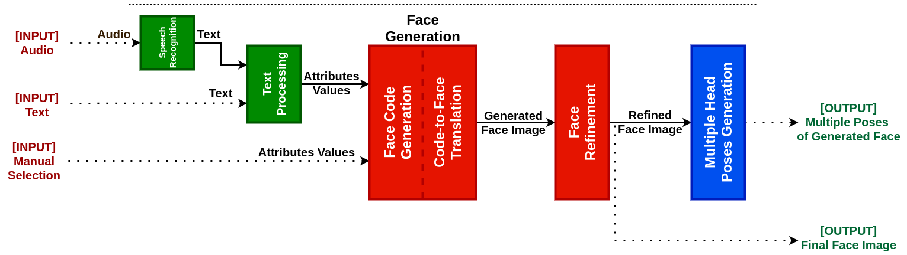

# Portrait Synthesis From Speech

<div align=center></div>

--------------------------------------------------------------------------------

This repository contains the main code for `portrait synthesis from speech` experiments associated with [Retratista](https://github.com/DarkGeekMS/Retratista) application.

## Dependencies

-   Install `python3` and `python3-pip`.

-   Install `requirements.txt` using `PyPi` :
    ```bash
    pip3 install -r requirements.txt
    ```

-   Alternatively, `Dockerfile` is provided with all required dependencies :
    ```bash
    docker build . -t portrait_syn_from_speech
    ```

-   Refer to individual `README.md` inside each component folder for further installation notes.

## System Architecture

<div align=center></div>

<div align="center">
Figure(1): Complete system architecture diagram showing the flow between different modules.
</div><br>

__Refer to the wiki for more information about the project application, architecture and workflow.__
